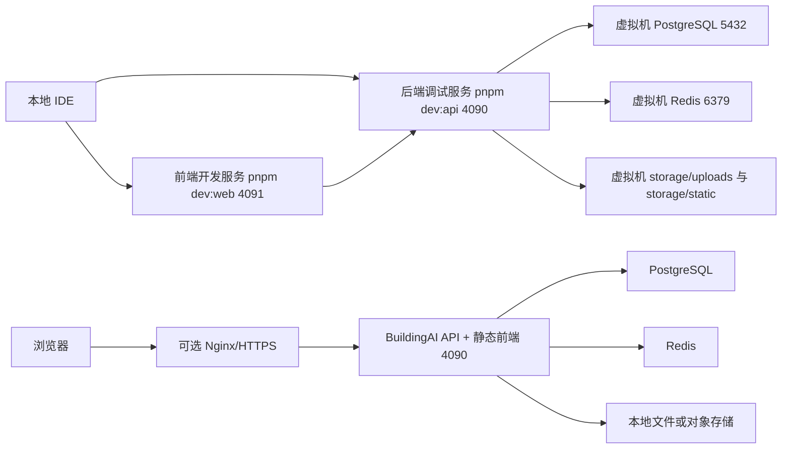

# BuildingAI 项目部署实施指南

## 1. 文档范围与部署结论

本文基于当前仓库源码、根配置、`package.json`、`docker-compose.yml`、`ecosystem.config.js`、`.env.example`、`packages/api` 与 `packages/client` 的实际实现编写，适用于 BuildingAI `26.1.1` 版本在本地开发环境与虚拟机环境中的部署、调试、运维和故障恢复。

推荐结论如下：

1. 开发环境：本地 IDE 仅运行源码、前端开发服务和后端调试服务，不在本机部署生产级 PostgreSQL、Redis 或文件存储。
2. 虚拟机环境：部署 PostgreSQL、Redis、Node 服务、文件存储目录和进程管理能力。
3. 生产或准生产部署：优先使用 `docker compose` 编排 `postgres`、`redis`、`nodejs` 三个服务。
4. 本地后端远程调试：本地运行 `pnpm dev:api`，通过 `.env` 连接虚拟机 PostgreSQL 与 Redis。
5. 本地前端远程联调：本地运行 `pnpm dev:web`，通过 `VITE_DEVELOP_APP_BASE_URL` 指向本地 API 或虚拟机 API。

目标虚拟机信息：

| 配置项 | 值 |
| --- | --- |
| 虚拟机 IP | `192.168.232.100` |
| SSH 账号 | `root` |
| 认证方式 | 使用用户提供的 root 密码；部分客户端需将认证超时时间提高到约 60 秒 |
| 应用端口 | `4090` |
| 前端开发端口 | `4091` |
| PostgreSQL 端口 | `5432` |
| Redis 端口 | `6379` |

安全说明：不要把真实 root 密码、数据库密码、Redis 密码、JWT 密钥写入 Git 仓库。本文只给出占位符与命令模板。

## 2. 架构维度

### 2.1 组件关系



### 2.2 应用构成

1. 根目录是 pnpm workspace + Turbo monorepo。
2. 后端位于 `packages/api`，使用 NestJS，生产入口为 `packages/api/dist/main.js`。
3. 前端位于 `packages/client`，使用 Vite + React，开发端口为 `4091`。
4. API 默认端口为 `4090`，健康检查路径为 `/consoleapi/health`。
5. 数据库使用 PostgreSQL，配置来自 `DB_*` 环境变量。
6. 缓存与队列使用 Redis，配置来自 `REDIS_*` 环境变量。
7. 文件上传默认落盘到根目录 `storage/uploads`，静态资源使用 `storage/static`、`public/web` 与扩展目录。
8. 进程管理使用 PM2，配置文件为 `ecosystem.config.js`。
9. Docker Compose 提供 `postgres`、`redis`、`nodejs` 三个服务。

### 2.3 资源分配建议

1. 2 核 4 GB 虚拟机：适合开发联调与小规模演示，`DOCKER_MEMORY_LIMIT=3584M`，`PM2_INSTANCES=1`。
2. 4 核 8 GB 虚拟机：适合准生产，`DOCKER_MEMORY_LIMIT=6144M`，`PM2_INSTANCES=2`。
3. PostgreSQL 与 Redis 不建议暴露到公网，仅允许本机、内网或 VPN 访问。
4. `storage/`、`docker/data/`、`logs/` 应放在可备份磁盘，避免和系统盘抢占空间。

## 3. 开发维度

### 3.1 本地开发环境准备

1. 安装 Node.js `22.20.x`，版本必须满足根 `package.json` 中的 `engines.node`：`>=22.20.x <23`。
2. 启用 pnpm：

```bash
corepack enable
corepack prepare pnpm@10.20.0 --activate
node --version
pnpm --version
```

预期输出示例：

```text
v22.20.0
10.20.0
```

3. 安装依赖：

```bash
pnpm install
```

4. 生成本地环境文件：

```bash
cp .env.example .env
pnpm sync-env
```

Windows PowerShell 可使用：

```powershell
Copy-Item .env.example .env
pnpm sync-env
```

### 3.2 本地前端开发

1. 配置 `.env`：

```dotenv
VITE_DEVELOP_APP_BASE_URL=http://localhost:4090
VITE_APP_WEB_API_PREFIX=/api
VITE_APP_CONSOLE_API_PREFIX=/consoleapi
```

2. 启动前端：

```bash
pnpm dev:web
```

3. 浏览器访问：

```text
http://localhost:4091
```

### 3.3 本地后端远程调试

本地后端连接虚拟机 PostgreSQL 与 Redis，适合断点调试、接口调试和详细日志分析。

1. 在虚拟机开放内网访问端口 `5432`、`6379`。
2. 本地 `.env` 示例：

```dotenv
NODE_ENV=development
SERVER_PORT=4090
SERVER_CORS_ENABLED=true
SERVER_CORS_ORIGIN=http://localhost:4091
SERVER_SHOW_DETAILED_ERRORS=true

DB_TYPE=postgres
DB_HOST=192.168.232.100
DB_PORT=5432
DB_USERNAME=buildingai
DB_PASSWORD=<强数据库密码>
DB_DATABASE=buildingai
DB_DEV_SYNCHRONIZE=true
DB_LOGGING=true

REDIS_HOST=192.168.232.100
REDIS_PORT=6379
REDIS_PASSWORD=<强 Redis 密码>
REDIS_DB=0
```

3. 启动后端调试服务：

```bash
pnpm dev:api
```

4. 如需 Node Inspector 断点调试，在 `packages/api` 下运行：

```bash
pnpm start:debug
```

5. 验证后端：

```bash
curl http://localhost:4090/consoleapi/health
curl http://localhost:4090/consoleapi/health/db
```

预期输出包含：

```json
{"status":"ok"}
```

### 3.4 代码提交规范

1. 提交前检查改动范围：

```bash
git status --short
```

2. 代码改动优先运行：

```bash
pnpm typecheck
pnpm lint
```

3. 文档改动无需构建，但需要记录：

```text
未涉及代码，无需构建；已执行 git status --short 确认文件清单。
```

## 4. 部署维度

### 4.1 虚拟机基础环境准备

以下命令以 Linux root 用户执行。不同发行版包管理器略有差异，先确认系统：

```bash
cat /etc/os-release
uname -a
```

CentOS/Rocky/AlmaLinux：

```bash
dnf update -y || yum update -y
dnf install -y git curl wget vim tar gzip firewalld
systemctl enable --now firewalld
```

Ubuntu/Debian：

```bash
apt-get update
apt-get install -y git curl wget vim tar gzip ufw ca-certificates gnupg
```

### 4.2 Docker 与 Compose 安装

如果使用 Docker 部署，虚拟机需要安装 Docker Engine 与 Compose 插件。

CentOS/Rocky/AlmaLinux：

```bash
dnf install -y yum-utils
yum-config-manager --add-repo https://download.docker.com/linux/centos/docker-ce.repo
dnf install -y docker-ce docker-ce-cli containerd.io docker-buildx-plugin docker-compose-plugin
systemctl enable --now docker
docker --version
docker compose version
```

Ubuntu/Debian：

```bash
install -m 0755 -d /etc/apt/keyrings
curl -fsSL https://download.docker.com/linux/ubuntu/gpg -o /etc/apt/keyrings/docker.asc
chmod a+r /etc/apt/keyrings/docker.asc
echo "deb [arch=$(dpkg --print-architecture) signed-by=/etc/apt/keyrings/docker.asc] https://download.docker.com/linux/ubuntu $(. /etc/os-release && echo "$VERSION_CODENAME") stable" > /etc/apt/sources.list.d/docker.list
apt-get update
apt-get install -y docker-ce docker-ce-cli containerd.io docker-buildx-plugin docker-compose-plugin
systemctl enable --now docker
docker --version
docker compose version
```

### 4.3 代码获取与版本策略

推荐部署目录：

```bash
mkdir -p /opt/buildingai
cd /opt/buildingai
```

方式一：从 Git 获取稳定版本：

```bash
git clone https://github.com/BidingCC/BuildingAI.git .
git checkout <稳定 tag 或 commit>
```

方式二：从本地工作区上传当前版本：

```bash
tar --exclude=node_modules --exclude=.git --exclude=.venv --exclude=docker/data --exclude=logs -czf buildingai-release.tgz .
scp buildingai-release.tgz root@192.168.232.100:/opt/
ssh root@192.168.232.100 "mkdir -p /opt/buildingai && tar -xzf /opt/buildingai-release.tgz -C /opt/buildingai"
```

版本策略：

1. 生产部署优先使用 Git tag。
2. 准生产可使用固定 commit。
3. 禁止直接以未记录来源的目录作为长期生产版本。
4. 每次升级前记录当前 commit：

```bash
cd /opt/buildingai
git rev-parse HEAD
git status --short
```

### 4.4 生产环境变量

1. 创建 `.env`：

```bash
cd /opt/buildingai
cp .env.example .env
```

2. 编辑关键配置：

```dotenv
APP_NAME=BuildingAI
APP_DOMAIN=http://192.168.232.100:4090

SERVER_PORT=4090
SERVER_CORS_ENABLED=true
SERVER_CORS_ORIGIN=http://192.168.232.100:4090
SERVER_SHOW_DETAILED_ERRORS=false
SERVER_IS_DEMO_ENV=false

JWT_SECRET=<至少32位随机字符串>
JWT_EXPIRES_IN=30d

DB_TYPE=postgres
DB_HOST=postgres
DB_PORT=5432
DB_USERNAME=buildingai
DB_PASSWORD=<强数据库密码>
DB_DATABASE=buildingai
DB_SYNCHRONIZE=false
DB_DEV_SYNCHRONIZE=false
DB_LOGGING=false

REDIS_HOST=redis
REDIS_PORT=6379
REDIS_PASSWORD=<强 Redis 密码>
REDIS_DB=0

LOG_LEVELS=error,warn,fatal
LOG_WRITE_LEVELS=error,warn,fatal,log
LOG_TO_FILE=true

VITE_PRODUCTION_APP_BASE_URL=
VITE_APP_WEB_API_PREFIX=/api
VITE_APP_CONSOLE_API_PREFIX=/consoleapi

NPM_REGISTRY_URL=https://registry.npmmirror.com
DOCKER_MEMORY_LIMIT=3584M
DOCKER_CPU_LIMIT=1.0
DOCKER_MEMORY_RESERVATION=512M
POSTGRES_EXTERNAL_PORT=
REDIS_EXTERNAL_PORT=
```

3. 同步环境变量：

```bash
pnpm sync-env
```

Docker 首次启动时如容器内未安装 pnpm，会在 `nodejs` 容器启动命令中自动安装 pnpm 与 pm2。

### 4.5 Docker Compose 部署流程

1. 启动服务：

```bash
cd /opt/buildingai
docker compose up -d
```

2. 查看容器：

```bash
docker compose ps
```

预期 `postgres`、`redis`、`nodejs` 为 running 或 healthy。

3. 查看应用日志：

```bash
docker compose logs -f nodejs
```

4. 验证健康检查：

```bash
curl -i http://127.0.0.1:4090/consoleapi/health
curl -i http://127.0.0.1:4090/consoleapi/health/db
```

基础健康检查预期输出：

```text
HTTP/1.1 200 OK
```

说明：`/consoleapi/health/db` 属于需要登录态的详细健康接口时，未认证访问会返回 `401 Unauthorized`；可结合容器健康状态、应用日志中的 PostgreSQL 与 Redis connected 记录确认数据库链路。

5. 从本机访问虚拟机：

```powershell
Test-NetConnection -ComputerName 192.168.232.100 -Port 4090
Invoke-WebRequest http://192.168.232.100:4090/consoleapi/health
```

### 4.6 PM2 部署流程

不使用 Docker 承载 Node 服务时，可使用 PM2。此模式仍建议数据库和 Redis 运行在虚拟机服务或独立容器中。

1. 安装 Node.js `22.20.x` 与 pnpm `10.20.0`。
2. 安装依赖：

```bash
cd /opt/buildingai
pnpm install
pnpm sync-env
```

3. 构建：

```bash
pnpm build
```

4. 启动 PM2：

```bash
pnpm pm2:start
pnpm pm2:status
```

5. 常用运维命令：

```bash
pnpm pm2:logs
pnpm pm2:reload
pnpm pm2:restart
pnpm stop
pnpm pm2:save
pnpm pm2:flush
```

### 4.7 服务启停与升级

Docker 模式：

```bash
cd /opt/buildingai
docker compose pull
git pull
docker compose up -d --build
docker compose ps
curl -f http://127.0.0.1:4090/consoleapi/health
```

PM2 模式：

```bash
cd /opt/buildingai
git pull
pnpm install
pnpm sync-env
pnpm build
pnpm pm2:reload
pnpm pm2:status
curl -f http://127.0.0.1:4090/consoleapi/health
```

## 5. 远程数据库配置指南

### 5.1 Docker PostgreSQL 初始化

Compose 使用以下环境变量初始化数据库：

```dotenv
DB_USERNAME=buildingai
DB_PASSWORD=<强数据库密码>
DB_DATABASE=buildingai
```

首次启动：

```bash
docker compose up -d postgres
docker compose logs -f postgres
```

验证：

```bash
docker exec -it buildingai-postgres psql -U buildingai -d buildingai -c "select version();"
```

### 5.2 远程访问权限

仅开发联调需要暴露 PostgreSQL 到虚拟机宿主端口。

1. `.env` 设置：

```dotenv
POSTGRES_EXTERNAL_PORT=5432
```

2. 重启：

```bash
docker compose up -d postgres
```

3. 检查监听：

```bash
ss -lntp | grep 5432
```

4. 本地连接字符串示例：

```text
postgresql://buildingai:<强数据库密码>@192.168.232.100:5432/buildingai
```

### 5.3 数据迁移与初始化

当前应用启动时由 `DatabaseInitService` 判断系统是否安装：

1. 未安装时执行 `dataSource.synchronize()` 并运行内置 seed。
2. 已安装时执行版本升级与扩展升级检查。
3. 扩展 schema 会在 `AppModule.register()` 中按启用扩展自动创建。

首次初始化命令：

```bash
docker compose up -d
docker compose logs -f nodejs
```

验证安装状态：

```bash
docker exec -it buildingai-postgres psql -U buildingai -d buildingai -c "select count(*) from config;"
docker exec -it buildingai-postgres psql -U buildingai -d buildingai -c "select count(*) from dict;"
```

### 5.4 数据库备份策略

1. 创建备份目录：

```bash
mkdir -p /opt/backups/buildingai/postgres
```

2. 执行逻辑备份：

```bash
docker exec buildingai-postgres pg_dump -U buildingai -d buildingai -Fc > /opt/backups/buildingai/postgres/buildingai-$(date +%F-%H%M%S).dump
```

3. 恢复到新库：

```bash
docker exec -i buildingai-postgres pg_restore -U buildingai -d buildingai --clean --if-exists < /opt/backups/buildingai/postgres/<备份文件>.dump
```

4. 配置定时备份：

```bash
crontab -e
```

加入：

```cron
30 2 * * * docker exec buildingai-postgres pg_dump -U buildingai -d buildingai -Fc > /opt/backups/buildingai/postgres/buildingai-$(date +\%F-\%H\%M\%S).dump
```

5. 验证备份：

```bash
ls -lh /opt/backups/buildingai/postgres
pg_restore --list /opt/backups/buildingai/postgres/<备份文件>.dump | head
```

## 6. 虚拟机防火墙配置

### 6.1 firewalld

1. 查看状态：

```bash
systemctl status firewalld
firewall-cmd --state
firewall-cmd --list-all
```

2. 开放应用端口：

```bash
firewall-cmd --permanent --add-port=4090/tcp
firewall-cmd --reload
firewall-cmd --list-ports
```

3. 仅内网开放数据库与 Redis：

```bash
firewall-cmd --permanent --add-rich-rule='rule family="ipv4" source address="192.168.232.0/24" port protocol="tcp" port="5432" accept'
firewall-cmd --permanent --add-rich-rule='rule family="ipv4" source address="192.168.232.0/24" port protocol="tcp" port="6379" accept'
firewall-cmd --reload
```

4. 验证：

```bash
firewall-cmd --list-rich-rules
ss -lntp
```

### 6.2 ufw

1. 查看状态：

```bash
ufw status verbose
```

2. 开放应用端口：

```bash
ufw allow 4090/tcp
ufw reload
```

3. 仅内网开放数据库与 Redis：

```bash
ufw allow from 192.168.232.0/24 to any port 5432 proto tcp
ufw allow from 192.168.232.0/24 to any port 6379 proto tcp
ufw reload
```

### 6.3 本地连通性验证

PowerShell：

```powershell
Test-NetConnection -ComputerName 192.168.232.100 -Port 4090
Test-NetConnection -ComputerName 192.168.232.100 -Port 5432
Test-NetConnection -ComputerName 192.168.232.100 -Port 6379
```

## 7. 前后端跨域解决方案

### 7.1 诊断方法

1. 浏览器打开开发者工具。
2. 查看 Network 面板中失败请求。
3. 判断是否出现以下响应头缺失：

```text
Access-Control-Allow-Origin
Access-Control-Allow-Credentials
```

4. 后端日志查看 CORS 启用记录：

```bash
docker compose logs nodejs | grep -i cors
```

### 7.2 后端 CORS 配置

后端 `packages/api/src/main.ts` 使用以下环境变量控制 CORS：

```dotenv
SERVER_CORS_ENABLED=true
SERVER_CORS_ORIGIN=http://localhost:4091
```

生产单域名部署建议：

```dotenv
SERVER_CORS_ENABLED=true
SERVER_CORS_ORIGIN=https://www.example.com
```

本项目后端启用 `credentials: true`。生产环境不要将 `SERVER_CORS_ORIGIN` 设置为 `*`，否则带凭证请求存在安全与兼容风险。

### 7.3 前端请求配置

开发环境：

```dotenv
VITE_DEVELOP_APP_BASE_URL=http://localhost:4090
```

前端直连虚拟机 API：

```dotenv
VITE_DEVELOP_APP_BASE_URL=http://192.168.232.100:4090
```

生产前后端同源：

```dotenv
VITE_PRODUCTION_APP_BASE_URL=
```

生产前后端分域：

```dotenv
VITE_PRODUCTION_APP_BASE_URL=https://api.example.com
```

### 7.4 验证命令

```bash
curl -i -H "Origin: http://localhost:4091" http://192.168.232.100:4090/consoleapi/health
```

预期响应头：

```text
Access-Control-Allow-Origin: http://localhost:4091
Access-Control-Allow-Credentials: true
```

## 8. 文件存储对接方案

### 8.1 存储选型

1. 开发与演示：使用本地磁盘 `storage/uploads`、`storage/static`。
2. 单机生产：使用本地磁盘并配置定时备份。
3. 多实例生产：使用对象存储，如 OSS 或 COS，并通过系统存储配置启用。

### 8.2 本地存储目录结构

```text
/opt/buildingai/
  storage/
    uploads/
    static/
  public/
    web/
  extensions/
    <identifier>/
      storage/
        uploads/
        static/
```

创建目录：

```bash
mkdir -p /opt/buildingai/storage/uploads /opt/buildingai/storage/static
chmod -R 750 /opt/buildingai/storage
```

Docker 模式下根目录会挂载到 `nodejs` 容器的 `/buildingai`，因此 `storage/` 会保留在宿主机项目目录内。

### 8.3 上传下载 API

源码中上传控制器位于 `packages/api/src/modules/upload/controllers/web/upload.controller.ts`，典型路径前缀来自 Web API：

```text
/api/upload
```

静态访问路径：

```text
/uploads/<文件路径>
/static/<文件路径>
```

### 8.4 权限控制

1. `storage/` 目录不授予全局写权限。
2. 容器或 Node 运行用户必须有读写权限。
3. Nginx 反代时限制上传体积：

```nginx
client_max_body_size 200m;
```

4. 对象存储使用最小权限 AK/SK，并定期轮换。

### 8.5 大文件与断点续传

当前 Multer 使用内存存储，适合普通文件上传。大文件建议：

1. 前端分片，后端合并或直传对象存储。
2. 对象存储启用分片上传。
3. 上传 API 返回文件唯一标识、分片序号、校验和。
4. Redis 记录上传会话状态。
5. 上传完成后写入数据库文件记录。

验证方法：

```bash
curl -I http://192.168.232.100:4090/uploads/<已上传文件>
```

预期：

```text
HTTP/1.1 200 OK
```

## 9. 环境排错指南

### 9.1 部署问题诊断流程

1. 确认端口可达：

```bash
ss -lntp
curl -i http://127.0.0.1:4090/consoleapi/health
```

2. 查看容器状态：

```bash
docker compose ps
docker compose logs --tail=200 postgres
docker compose logs --tail=200 redis
docker compose logs --tail=300 nodejs
```

3. 查看数据库连接：

```bash
docker exec -it buildingai-postgres pg_isready -U buildingai
docker exec -it buildingai-postgres psql -U buildingai -d buildingai -c "select 1;"
```

4. 查看 Redis 连接：

```bash
docker exec -it buildingai-redis redis-cli -a '<Redis 密码>' ping
```

预期：

```text
PONG
```

### 9.2 日志收集

Docker：

```bash
mkdir -p /opt/buildingai-diagnostics
docker compose ps > /opt/buildingai-diagnostics/compose-ps.txt
docker compose logs --tail=1000 > /opt/buildingai-diagnostics/compose-logs.txt
tar -czf /opt/buildingai-diagnostics-$(date +%F-%H%M%S).tgz /opt/buildingai-diagnostics
```

PM2：

```bash
pnpm pm2:status
pnpm pm2:logs
tail -n 300 logs/pm2/api-combined.log
```

### 9.3 典型错误与处理

| 现象 | 可能原因 | 处理方式 |
| --- | --- | --- |
| `ECONNREFUSED 5432` | PostgreSQL 未启动或端口未映射 | 检查 `docker compose ps`、`POSTGRES_EXTERNAL_PORT`、防火墙 |
| `NOAUTH Authentication required` | Redis 设置了密码但客户端未携带密码 | 检查 `REDIS_PASSWORD` |
| `ERR AUTH <password> called without any password configured` | Redis 容器未按 `REDIS_PASSWORD` 启用 `requirepass` | 确认 compose 中 Redis 启动命令包含 `redis-server --requirepass "$$REDIS_PASSWORD"` |
| `pnpm sync-env` 后生产变量丢失 | 同步脚本删除了 `.env.example` 中不存在的部署变量 | 默认保留已有变量；仅在本地清理时设置 `SYNC_ENV_REMOVE_OBSOLETE=true` |
| `/consoleapi/health/db` 失败 | 数据库或 Redis 连接异常 | 查看 nodejs、postgres、redis 日志 |
| 浏览器 CORS 报错 | `SERVER_CORS_ORIGIN` 不匹配 | 设置为真实前端来源 |
| 登录后 Cookie 不生效 | 跨域凭证与 HTTPS 配置不一致 | 确认 `credentials`、域名、SameSite、反代头 |
| 上传文件 413 | Nginx 或网关限制体积 | 调整 `client_max_body_size` |
| Node 容器构建慢 | 依赖下载慢或内存不足 | 设置 `NPM_REGISTRY_URL` 与 `DOCKER_MEMORY_LIMIT` |

### 9.4 监控与告警

1. 基础健康检查：

```bash
curl -fsS http://127.0.0.1:4090/consoleapi/health || exit 1
curl -fsS http://127.0.0.1:4090/consoleapi/health/db || exit 1
```

2. 磁盘监控：

```bash
df -h
du -sh /opt/buildingai/storage /opt/buildingai/docker/data /opt/buildingai/logs
```

3. Docker 自动重启已在 compose 中配置，仍建议外部监控定时检查。

## 10. 优化方案

### 10.1 优化一：数据库与 Redis 仅内网暴露

实施步骤：

1. 生产 `.env` 保持：

```dotenv
POSTGRES_EXTERNAL_PORT=
REDIS_EXTERNAL_PORT=
```

2. 如开发联调必须开放端口，仅允许 `192.168.232.0/24`：

```bash
firewall-cmd --permanent --add-rich-rule='rule family="ipv4" source address="192.168.232.0/24" port protocol="tcp" port="5432" accept'
firewall-cmd --permanent --add-rich-rule='rule family="ipv4" source address="192.168.232.0/24" port protocol="tcp" port="6379" accept'
firewall-cmd --reload
```

预期效果：降低数据库和 Redis 被外部扫描、暴力破解和误操作的风险。

验证方法：

```bash
firewall-cmd --list-rich-rules
Test-NetConnection -ComputerName 192.168.232.100 -Port 5432
```

### 10.2 优化二：应用健康检查与自动恢复

实施步骤：

1. Docker 模式保留 compose healthcheck。
2. PM2 模式启用自动重启：

```dotenv
PM2_AUTORESTART=true
PM2_MAX_MEMORY=1G
```

3. 增加定时探测脚本：

```bash
cat > /usr/local/bin/check-buildingai.sh <<'EOF'
#!/usr/bin/env bash
set -euo pipefail
curl -fsS http://127.0.0.1:4090/consoleapi/health >/dev/null
EOF
chmod +x /usr/local/bin/check-buildingai.sh
```

预期效果：服务异常时快速暴露问题，并通过 Docker 或 PM2 自动恢复。

验证方法：

```bash
/usr/local/bin/check-buildingai.sh
echo $?
```

### 10.3 优化三：静态与上传资源分层备份

实施步骤：

1. 每日备份 `storage/`：

```bash
mkdir -p /opt/backups/buildingai/storage
tar -czf /opt/backups/buildingai/storage/storage-$(date +%F-%H%M%S).tgz -C /opt/buildingai storage
```

2. 每日备份 PostgreSQL：

```bash
docker exec buildingai-postgres pg_dump -U buildingai -d buildingai -Fc > /opt/backups/buildingai/postgres/buildingai-$(date +%F-%H%M%S).dump
```

3. 定期清理 30 天前备份：

```bash
find /opt/backups/buildingai -type f -mtime +30 -delete
```

预期效果：减少误删、磁盘损坏和升级失败导致的数据丢失。

验证方法：

```bash
ls -lh /opt/backups/buildingai/postgres
ls -lh /opt/backups/buildingai/storage
```

### 10.4 优化四：构建与运行资源隔离

实施步骤：

1. 构建时使用较高 Node 内存：

```bash
NODE_OPTIONS=--max-old-space-size=3072 pnpm build
```

2. Docker 模式限制资源：

```dotenv
DOCKER_MEMORY_LIMIT=6144M
DOCKER_CPU_LIMIT=2.0
DOCKER_MEMORY_RESERVATION=512M
```

3. PM2 模式限制内存：

```dotenv
PM2_MAX_MEMORY=1G
PM2_INSTANCES=1
```

预期效果：避免构建或运行阶段挤占系统资源导致数据库和 Redis 抖动。

验证方法：

```bash
docker stats --no-stream
pnpm pm2:status
```

## 11. 当前部署执行记录

截至本轮部署完成时，已完成以下验证：

1. 已确认本地仓库根目录存在 `package.json`、`pnpm-workspace.yaml`、`docker-compose.yml`、`.env.example`、`ecosystem.config.js`。
2. 已确认项目要求 Node.js `>=22.20.x <23`，pnpm `10.20.0`。
3. 已确认 Docker Compose 定义 `redis`、`postgres`、`nodejs` 三个服务。
4. 已确认 API 健康检查路径为 `/consoleapi/health`、`/consoleapi/health/detail`、`/consoleapi/health/db`。
5. 已确认本机到虚拟机 `192.168.232.100:22` TCP 连通。
6. 使用用户提供的 root 密码登录成功；该虚拟机 SSH 认证耗时较长，客户端需设置约 60 秒认证超时。
7. 已修复虚拟机默认网关，当前可通过外网安装依赖与拉取镜像。
8. 已安装 Git、Docker `24.0.9` 与 Docker Compose `v2.27.1`；Docker `26.x` 在该 CentOS 7 环境中出现网络操作兼容问题，已降级规避。
9. 已将当前工作区上传到 `/opt/buildingai` 并写入生产 `.env`，密钥、数据库密码和 Redis 密码均使用强随机值，未写入仓库。
10. 已修复 `scripts/sync-env.mjs`，默认保留 `.env` 中的部署专用变量；仅设置 `SYNC_ENV_REMOVE_OBSOLETE=true` 时删除过期变量。
11. 已修复 Redis Compose 启动命令，存在 `REDIS_PASSWORD` 时自动启用 `requirepass`。
12. 已开放 `4090/tcp`，并通过内网规则开放 `5432/tcp` 与 `6379/tcp`。
13. `docker compose ps` 显示 `buildingai-nodejs`、`buildingai-postgres`、`buildingai-redis` 均为 healthy。
14. 虚拟机本机 `curl -i http://127.0.0.1:4090/consoleapi/health` 返回 `HTTP/1.1 200 OK`。
15. 开发机访问 `http://192.168.232.100:4090/consoleapi/health` 返回 200；`Test-NetConnection` 验证 `4090`、`5432`、`6379` 均可达。
16. 应用日志显示 Redis connected、PostgreSQL connected、`Env: production`、`App Version: v26.1.1`。
17. `/consoleapi/health/db` 未登录访问返回 `401 Unauthorized`，这是接口鉴权行为；本轮以基础健康检查、容器健康状态和应用日志作为数据库连接验证依据。

后续运维建议：

1. 尽快改用普通 sudo 用户与 SSH 密钥，减少 root 密码登录风险。
2. 如不需要本地直连数据库和 Redis，将 `POSTGRES_EXTERNAL_PORT`、`REDIS_EXTERNAL_PORT` 置空并移除防火墙内网放行规则。
3. 为 `/opt/buildingai/docker/data`、`/opt/buildingai/storage` 与 `/opt/buildingai/logs` 配置定时备份。
4. 后续升级按以下顺序执行：

```bash
ssh root@192.168.232.100
cd /opt/buildingai
docker compose pull
docker compose up -d --build
docker compose ps
curl -f http://127.0.0.1:4090/consoleapi/health
```
